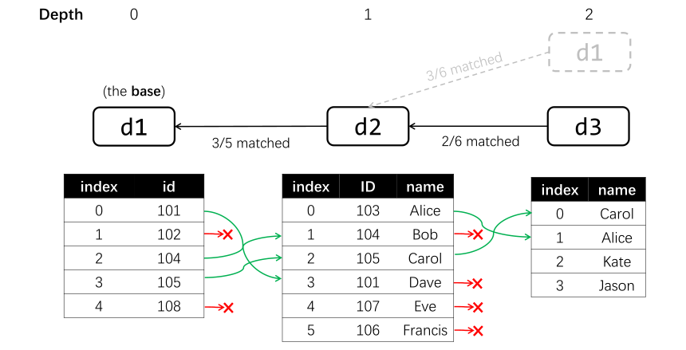

# Tree Matching When Keeping Unmatched Rows
## Description of the caveat
As an example, consider the matching tree mentioned [here](../match/tree_match_merge.md#merging-data-tables):

In this example, `d3` is not directly matched with `d1`, and we rely on the records in `d2` to match `d3` with `d1`. By default, only instances (in this case, people) that have corresponding rows in all relevant tables (`d1`, `d2`, and `d3`) are kept after merging (`d1.merge()`). By setting [the `unmatched` argument](../match/tree_match_merge.md#keeping-unmatched-rows), we can retain instances that do not have corresponding rows in specific tables. 

However, in the matching tree example above, we cannot retain instances that are not recorded in `d2`, because `d2` acts as the intermediary. Even if a person is missing from `d2`, its information might still be recorded in both `d1` and `d3`. For example, *Kate*'s ID might be *102*, so `d1[1]` might correspond to the same person as `d3[2]`. By matching `d3` with `d1` indirectly through `d2` (i.e., `d1<-d2<-d3`), you implicity require the instance to be present in `d2`.

## General suggestions
- If you wich to retain instances that are missing from some of the matched tables, you may prefer to avoid using the tables as intermediaries. If possible, it can be more straightforward to match all tables directly with the base table, which makes the tree shallower.
- Depending on your needs, you can explore different choices for the base table and matching methods to construct a matching tree thet best suits your requirements.

<!-- ## Discussions -->

