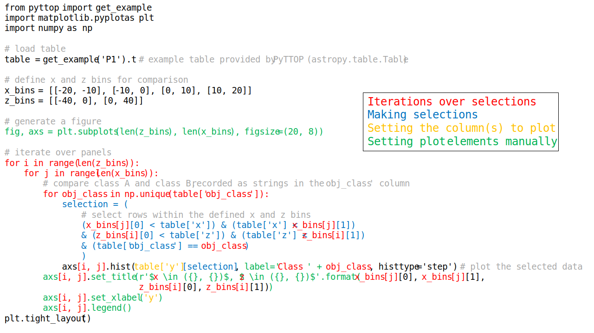
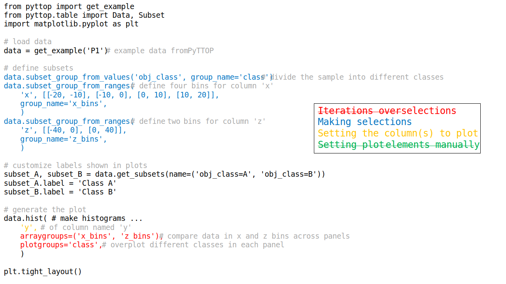

---
jupytext:
  cell_metadata_filter: -all
  formats: md:myst
  text_representation:
    extension: .md
    format_name: myst
    format_version: 0.13
    jupytext_version: 1.16.1
kernelspec:
  display_name: Python 3 (ipykernel)
  language: python
  name: python3
---

# Why PyTTOP?

This page introduces the key features and highlights of PyTTOP. 
- PyTTOP is a Python package designed to make the process of [table operations](../basics/basics), [matching](../match/match), subsample definition ([row subsets](../subset/subset)), and [plotting](../plot/plot) smooth and intuitive ([this section](#what-pyttop-does)).
- The nature of Python makes coding, customization and debugging easier ([this section](#python-capabilities)).
- PyTTOP offers simple, intuitive usage that automates tasks with simple code ([this section](#straightforward-usage)).
- When compared to typical code, PyTTOP improves the ease of exploration---particularly when frequently adjusting settings---by clearly separating different tasks in the code ([this section](#clear-code-structure)).
- Automation does not mean sacrificing control, because PyTTOP is designed to be flexible, allowing you to retain contorl over the details ([this section](#extendability)).

(what-pyttop-does)=
## What PyTTOP Does
**Table matching, subsetting, and plotting are fundamental tasks in statistical studies based on data samples.**
Many studies involve the analysis of tables, which typically records the properties of a sample of objects. Each *row* represents an individual object (record, entry), and each *column* corresponds to a specific property (attribute, field). During statistical analysis, the following tasks and scenarios are commonly encountered:
- Properties of interest come from separate tables, requiring **matching** of rows representing the same object in different tables to create a combined dataset. 
- The study focuses on only a subsample of objects (or several subsamples for comparison) defined by specific properties. In such cases, one or more **subsets** (subsamples) of the main sample need to defined.
- Visualizing the properties of selected objects is key for exploring and presenting the patterns within the data. These **plots** can also include comparsions of different subsets of objects, either through overlaid plots or separate panels. 

<!-- These tasks are a common feature in research papers in this field. The *Data* section in such a paper typically describes the data sources, how the tables are combined (matched), and how the sample (or various comparative subsamples) is selected for the study. The *Results* and *Discussion* sections often feature plots of object properties, sometimes comparing different subsamples through overlaid plots or separate panels.  -->

**PyTTOP is a Python package designed to make these tasks as smooth and intuitive as possible.** 
While the need for table operations and plotting is easy to state, implementing them in code can be more complex. <!-- One have to consider how data are stored, how subsets and plot elements are specified, and how to manage frequent adjustments. Even when code can be easily written - whether manually or with generative models - it becomes tedious when settings such as plotted properties and selected subsets need constant modification, espeicially in the early stages of data exploration.--> Even when code is simple to write, it can become tedious to constantly modify settings like plot properties and subset selections during data exploration. For example, confusion can arise when changing the plotted property but forgetting (or finding it too tedious) to update the corresponding axis or colorbar labels. 

The *Python Tools for Table Operations and Plotting (PyTTOP)* is developed hoping to streamline and simplify these fundamental tasks, allowing scientists to focus on their analyses rather than the underlying implementation detail. *Let PyTTOP handle the tedious work so you can concentrate on the science.*

```{code-cell}
:tags: [remove-cell]
from pyttop import get_example
from pyttop.table import Data, Subset
import matplotlib.pyplot as plt

data = get_example('P1')

data.subset_group_from_values('obj_class', group_name='class')
data.subset_group_from_ranges(
    'x', [[-20, -10], [-10, 0], [0, 10], [10, 20]], # 4 bins specified for x
    group_name='x_bins',
    )
data.subset_group_from_ranges(
    'z', [[-40, 0], [0, 40]],
    group_name='z_bins',
    )
subset_A, subset_B = data.get_subsets(name=('obj_class=A', 'obj_class=B'))
subset_A.label = 'Objects of Class A'
subset_B.label = 'Objects of Class B'
subset_xbin = data.get_subsets('x_bins/x(0-10)')
```

##  Highlights of the Package
Why may PyTTOP be useful for you? Let us take a look at the highlights of this package:

<!-- ### Python package: a full control  -->
<!-- ### Full control with Python -->
(python-capabilities)=
### Utilizing Python's capabilities
- **Python integration:** PyTTOP is a Python package, rather than a predefined graphical user interface, allowing seamless integration into your analysis code. 
- **Leveraging Python's ecosystem:** With Python, you gain access to a vast ecosystem of libraries for data analysis (e.g., NumPy, SciPy) and plotting (e.g., Matplotlib, Seaborn), offering full flexibility for data operations and plot customization. <!-- As a popular language in this field. You can make any publication-ready plots according to your needs, rather than the limited predefined style. -->
- **Reproducibility and Debugging:** All your operations are written and recorded in your code, ensuring transparency and easy debugging. You won't lose track of how tasks were performed.

<!-- ### Simplified coding and automatic handling easy-to-use -->
(straightforward-usage)=
### Straightforward usage with simplicity and automation
- **Matching and merging tables** ([details](../match/match)).
  With tables loaded and matching methods selected, merging two tables can be as simple as:
  ```Python
  >>> table1.match(table2, ExactMatcher('id_column')); table1.merge()
  ```
- **Exploring subsets** ([details](../subset/subset)).
  With subsets defined, checking and combining them is straightforward:
  ```Python
  >>> lovely_cats = is_cat & is_lovely; lovely_cats
  <Subset 'is_cat AND is_lovely' of Data 'my_friends' (2/5)>
  ```
- **Automatic plot making** ([details](../plot/plot_single)).
  You want to create a scatter plot of properties `x` versus `y`, with `z` indicated by color, for only objects in Class A. 
  With data and subsets prepared, simply provide what you would like to plot, and PyTTOP handles the rest:
  ```Python
  data.scatter('x', 'y', c='z', s=2, subsets=subset_A)
  ```
  PyTTOP automatically adds the colorbar, labels, and indicates the subset, all with one line of code.
  <!-- The colorbar is shown, the labels are added, the subset indicated, with one line of code. -->
```{code-cell}
:tags: [remove-input]
data.scatter('x', 'y', c='z', s=2, subsets=subset_A);
```
- **Creating plots comparing subsets** ([details](../plot/plot_subsets)).
  You want to compare the `y` distribution for different bins of `x` and `z` and for Class A and Class B. With data and subsets (groups) prepared, a single line of code generates the plot:
  ```Python
  data.hist('y', plotgroups='class', arraygroups=('x_bins', 'z_bins'))
  ```
  Legends, labels, and subset indications are automatically added.
```{code-cell}
:tags: [remove-input]
subset_A.label = 'Class A'
subset_B.label = 'Class B'
data.hist('y', plotgroups='class', arraygroups=('x_bins', 'z_bins'))
plt.tight_layout()
```
- **And more**: you can explore more features provided by PyTTOP in the documentation.

(clear-code-structure)=
### Clear code structure with PyTTOP
<!-- one task a time: subset, plotfunc, col label, plots(); simple changing for exploration without redundant code changes. explain in an example comparing code with and without pyttop -->

If the above is still not specific enough, we can further compare the full code with and without PyTTOP. 

Suppose we want to create the figure shown above, which compares the histogram of `y` across different `x` and `z` bins (in different panels) and for the two classes (Class A and Class B, overlaid in the same panels). 
This involves working with the table shown below:
```{code-cell}
:tags: [remove-input]
from astropy import conf
conf.max_lines = 13
data.t
```

Without PyTTOP, one possible way to produce the figure is with the following code (note that this version is not the most concise but illustrates a straightforward implementation):

```{code-cell}
:tags: [hide-input, remove-output]
from pyttop import get_example
import matplotlib.pyplot as plt
import numpy as np

# load table
table = get_example('P1').t # example table provided by PyTTOP (astropy.table.Table)

# define x and z bins for comparison
x_bins = [[-20, -10], [-10, 0], [0, 10], [10, 20]]
z_bins = [[-40, 0], [0, 40]]

# generate a figure
fig, axs = plt.subplots(len(z_bins), len(x_bins), figsize=(20, 8))

# iterate over panels
for i in range(len(z_bins)):
    for j in range(len(x_bins)):
        # compare class A and class B, recorded as strings in the 'obj_class' column
        for obj_class in np.unique(table['obj_class']):
            selection = (
                # select rows within the defined x and z bins
                (x_bins[j][0] < table['x']) & (table['x'] < x_bins[j][1]) 
                & (z_bins[i][0] < table['z']) & (table['z'] < z_bins[i][1])
                & (table['obj_class'] == obj_class)
                ) 
            axs[i, j].hist(table['y'][selection], label='Class ' + obj_class, histtype='step') # plot the selected data
        axs[i, j].set_title(r'$x \in ({}, {})$, $z \in ({}, {})$'.format(x_bins[j][0], x_bins[j][1], z_bins[i][0], z_bins[i][1]))
        axs[i, j].set_xlabel('y')
        axs[i, j].legend()
plt.tight_layout()
```

As highlighted in the code, *the tasks are tightly coupled within each line*. Each line simultaneously handles multiple responsibilities, including: iterating over selections (e.g., `x` bins, `z` bins, and classes), making selections by filtering rows, setting the column(s) to plot (e.g., `hist` of the `y` column), and manually configuring plot elements such as subplots, axis labels, plot labels, legends, and titles based on the selections. 

This mixture of tasks within each line makes it cumbersome to modify any part of the process. For example, if you want to change the plot type (e.g., from `hist` to `scatter`), change the column being plotted (e.g., from `y` to `x, y`), or adjust the selections (e.g., using different criteria to define bins or classes), you would need to go through each line and update all relevant parts---this can quickly become tedious. 

In contrast, the PyTTOP counterpart simplifies this process, as shown below:

```{code-cell}
:tags: [hide-input, remove-output]
from pyttop import get_example
from pyttop.table import Data, Subset
import matplotlib.pyplot as plt

# load data
data = get_example('P1') # example data from PyTTOP

# define subsets
data.subset_group_from_values('obj_class', group_name='class') # divide the sample into different classes
data.subset_group_from_ranges( # define four bins for column 'x'
    'x', [[-20, -10], [-10, 0], [0, 10], [10, 20]],
    group_name='x_bins',
    )
data.subset_group_from_ranges( # define two bins for column 'z'
    'z', [[-40, 0], [0, 40]],
    group_name='z_bins',
    )

# customize labels shown in plots
subset_A, subset_B = data.get_subsets(name=('obj_class=A', 'obj_class=B'))
subset_A.label = 'Class A'
subset_B.label = 'Class B'

# generate the plot
data.hist( # make histograms ...
    'y', # of column named 'y'
    arraygroups=('x_bins', 'z_bins'), # compare data in x and z bins across panels 
    plotgroups='class', # overplot different classes in each panel
    )

plt.tight_layout()
```

As shown, PyTTOP simplifies this process by:
- **Separating tasks**. All relevant selections (`x` bins, `z` bins, and classes) are defined as subset groups in advance. When plotting, you only need to specify the plot type, columns to be plotted, and the subsets (i.e., subsamples) you want to compare (and setting whether they are shown in different panels or overlaid). 
- **Automatically generating plot elements**. Plot elements like titles, legends, and labels are automatically generated according to the plotted columns, subsets, etc. There is no need to manually set or update them when changes are made. 

Therefore, *making changes is as simple as adjusting the settings, which is more efficient and less error-prone*. This makes exploring various aspects of your data much easier and more manageable. 


<!-- **One task at a time**:
**Flexibility in changing elements**: -->


<!-- ### Extendibility: you have more controls -->
(extendability)=
### Extendibility: flexible controls and customization
The default plot styles and matching methods do not meet your specific needs? No problem---PyTTOP gives you the flexibility to customize them.
<!-- The style of plots and methods for matching shown above do not meets your needs? No problem.  -->
- **Customization**. If you are not satisfied with the autogenerated labels, titles, figure and subplot organization, or plot options, PyTTOP lets you control any of them ([details](../plot/plot_customize)). 
- **Extendibility** ([details](../extension/extension)). PyTTOP's framework is designed to be flexible, allowing you to define your own matching and plotting methods. You have control over their details, while PyTTOP takes care of the more tedious tasks.
<!--PyTTOP provides a framework without limiting the specific method of matching and plotting.-->  

## What to do next?
If you are ready to try PyTTOP, you can [install](../start/Installation) it using `pip`. If you want to explore a more specific example of its usage, read the [quickstart example](../tutorials/quickstart) tutorial. 
