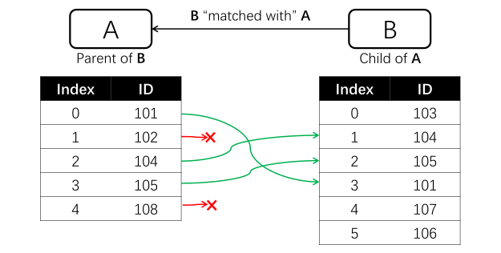
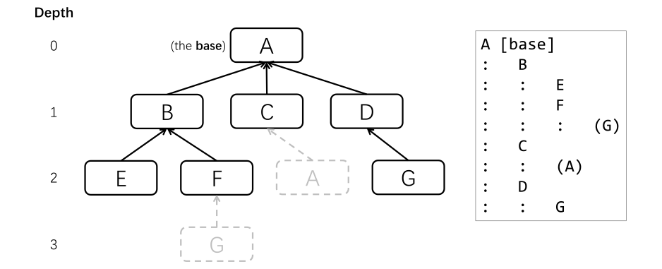

# Matching Tables
Matching tables refers to the process of determining which row (if any) in one table corresponds to a specific row in another table. As of version 0.4.x, PyTTOP provides a matching framework called "tree matching", as defined and illustrated below.

## Basics concepts of "tree matching"
"Tree matching" is particularly useful for merging multiple tables simultaneously, even when different tables are matched using different criteria.

In the framework of tree matching, A table *B* is said to be matched with another table *A* if, for *each* row in *A*, the following information is recorded:
- Whether a match exists, i.e., whether a corresponding row in B can be found.
- If a match exists, *exactly one* row in *B* is recorded as corresponding to that row in *A*.

If the above conditions are met, *A* is considered the parent of *B*, and *B* is the child of *A*.

This can be illustrated with the following diagram:



Each table can have multiple tables matched to it (children), and each child table can also be the parent of several other tables. This creates a diagram that forms a tree-like hierarchical structure, as illustrated below:



In the above diagram, *A* is choson as the base (root) table, positioned at the uppermost level. The other tables are matched with either *A* or its children (or its children's chilren, and so on). During the process of finding children, any tables that have already been encountered at a higher level (i.e., at a smaller depth) are ignored and not expanded to lower levels (i.e., greater depths) to prevent redundant iteration. 

With this tree diagram, all relevant tables (from *B* to *G*) can ultimately be merged into the base table, *A*, as described [here](tree_match_merge.md#merging-data-tables). The text representation of the above tree diagram is shown in the box on the right.

```{tip}
In tree matching, the "match" relationship between two tables is non-commutative; that is, matching *B* with *A* is not the same as matching *A* with *B*. When dealing with multiple tables, the structure of the matching tree depends on the choice of the "base table," even if the underlying graph of connections between tables remains the same. These features can be seen in the diagrams above. For example, *A* is matched with *C*, and *C* is also matched with *A*. If *C* were chosen as the base table, the resulting tree structure would be different.
```

## Built-in matchers
A *matcher* matches a `Data` table with another, i.e., finding one corresponding row (if any) in the second `Data` for each row in the first `Data`, as defined [above](#basics-concepts-of-tree-matching). The basic usage of matching `Data` is as follows:
```Python
data.match(data1, Matcher(<matcher settings>))
```
In the code above, `data1` is matched to `data`, where `data1` is the child `Data` and `data` is the parent. Different matcher requires different settings, as detailed below.

The following lists built-in matchers provided by PyTTOP.

### `IdentityMatcher`
The `IdentityMatcher` directly matches tables row by row, meaning the i-th row in `data1` corresponds to the i-th row in `data`. This results in the two tables simply being stacked horizontally. The basic usage is as follows:
```Python
from pyttop.matcher import IdentityMatcher
data.match(data1, IdentityMatcher())
```

### `ExactMatcher`
The `ExactMatcher` matches tables by comparing the exact values of corresponding columns in the two tables. The columns typically contain names or IDs of objects, and the same name or ID refers to the same object. The basic usage is as follows:
```Python
from pyttop.matcher import ExactMatcher
data.match(data1, ExactMatcher('col', 'col1'))
```
In the code above, we specify a column named `'col'` in `data` and a column named `'col1'` in `data1`. For each row in `data`, the row in `data1` with the *same* value in the specified columns (`'col'` in `data` and `'col1'` in `data1`) will be matched.

```{caution}
Even if there are [duplicate values](../basics/operations.md#checking-for-duplicate-values) in the specified column (especially in `data1`), only one row with the matching value will be matched, and a warning message will be printed. It is recommended to handle duplicates before performing the matching.
```

If the column names for `data` and `data1` are the same, you can simply use:
```Python
data.match(data1, ExactMatcher('col'))
```
In this case, the matcher will compare the `'col'` column in both tables for matching values.

You can also directly provide arrays (or columns, lists, etc.) instead of column names. For example:
```Python
data.match(data1, ExactMatcher('col', data1['col1'] * 10))
```


### `SkyMatcher`
The `SkyMatcher` matches tables by computing the *2D* angular distances between rows, based on their RA and Dec coordinates. For each row in `data`, the row in `data1` with the *nearest* 2D seperation that is smaller than a specified threshold (defaulting to 1 arcsec) will be matched. The threshold, the column names containing RA and Dec, and the units of RA and Dec can be specified as follows:
```Python
from pyttop.matcher import SkyMatcher
import astropy.units as u
data.match(data1, SkyMatcher(
    thres=1, # threshold in arcsec; defaults to 1 arcsec
    coord='RA-Dec', coord1='ra-dec', # column names for RA and Dec in `data` and `data1`, respectively
    unit=(u.deg, u.deg), unit1=(u.hourangle, u.deg), # units for RA and Dec in `data` and `data1`, respectively; defaults to degree
    ))
```
Note that the RA and Dec data columns may already have units (e.g., ``data['RA'].unit``). In this case, any input for ``unit`` or ``unit1`` will be ignored, and the units recorded in the columns will be used instead. If `coord` and/or `coord1` are not specified, the RA and Dec columns will be automatically detected. By using the defaults, the code can be simplified to:
```Python
data.match(data1, SkyMatcher())
```

```{tip}
For non-astronomers: RA (right ascension) and Dec (declination) are sky coordinates used to describe a direction on the sky using two angles. They are somewhat similar to longitude and latitude, respectively.
```

You can also directly provide [`SkyCoord`](https://docs.astropy.org/en/stable/api/astropy.coordinates.SkyCoord.html#astropy.coordinates.SkyCoord) objects, as provided by astropy and described [here](https://docs.astropy.org/en/stable/coordinates/), for `coord` and `coord1`.
