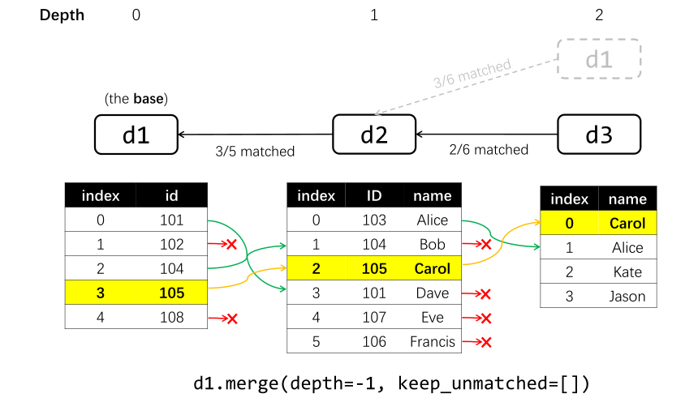
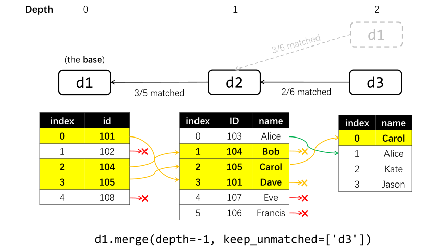
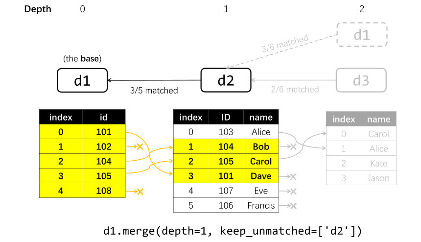

---
jupytext:
  cell_metadata_filter: -all
  formats: md:myst
  text_representation:
    extension: .md
    format_name: myst
    format_version: 0.13
    jupytext_version: 1.16.1
kernelspec:
  display_name: Python 3 (ipykernel)
  language: python
  name: python3  
---

# Managing Matches and Merging

## Checking the match tree
The matching tree, with `data` as the base, can be printed using the `match_tree()` method:
```Python
data.match_tree()
```
The "match tree" will be displayed in a text-based format, as illustrated in the [Basics concepts of "tree matching"](tree_match_basic.md#basics-concepts-of-tree-matching). A typical output should look like this:
```
data [base]
:   data1 [<matcher used to match data1 with data>]
:   :    (data) [<matcher used to match data with data1>]
:   data2 [<matcher used to match data2 with data>]
:   :    data3 [<matcher used to match data3 with data2>]
```
The indentation represents the depth of the data, with the base data at a zero indentation level, and each deeper level indented further. The [names](../basics/IO.md#reading-tables-from-files) of relevant `Data` objects are printed. A name with parentheses '()' indicates that the `Data` has already been encountered at a shallower depth and will therefore be ignored when merging. The information in square brackets '[]' after the data names (except for the base data) indicates the matcher used for the corresponding matching. 

You can adjust the depth and suppress the matching information in square brackets '[]' by using:
```Python
data.match_tree(depth=1, detail=False)
```
This will change the output to something like:
```
data 
:   data1
:   data2
```
The default value for `depth` is `-1`, meaning an infinite depth.

## Removing matches
You can use the `unmatch()` method to remove the match of a `Data` object:
```Python
data.unmatch(data1)
```
This will make `data1` no longer matched with `data`.

To remove all matching information for `data`, use:
```Python
data.reset_match()
```

## Merging `Data` tables
### The basics
Given a match tree (see the [Basics concepts of "tree matching"](tree_match_basic.md#basics-concepts-of-tree-matching)), all the `Data` objects in the tree can be merged <!-- into the base `Data`  --> using its `merge()` method. Its usage is illustrated in the examples below.
<!-- This process is done in the below manner:
- For each row in the base data, merge the corresponding row (if any) in all its children data. -->
<!-- - For each row that has the corresponding row in each child data,  -->
<!-- - For the children's children and so on, the corresponding row (if any)  -->

Suppose we have several tables recording the ID numbers and names of people, and the tables can be matched:
```{code-cell}
from pyttop.table import Data
from pyttop.matcher import ExactMatcher

# construct data
d1 = Data(name='d1')
d1['index'] = [0, 1, 2, 3, 4]
d1['id'] = [101, 102, 104, 105, 108]

d2 = Data(name='d2')
d2['index'] = [0, 1, 2, 3, 4, 5]
d2['ID'] = [103, 104, 105, 101, 107, 106]
d2['name'] = ['Alice', 'Bob', 'Carol', 'Dave', 'Eve', 'Francis']

d3 = Data(name='d3')
d3['index'] = [0, 1, 2, 3]
d3['name'] = ['Carol', 'Alice', 'Kate', 'Jason']

for d in (d1, d2, d3):
    print(d)
    print(d.t, '\n')

# match
d1.match(d2, ExactMatcher('id', 'ID'))
d2.match(d3, ExactMatcher('name'))
d2.match(d1, ExactMatcher('ID', 'id'))
print()
d1.match_tree()
```

<!-- Using the default settings, the `merge()` method merges all relevant `Data` (in this case, `d2` and `d3`) into the base `Data` (`d1`), retaining only the rows in the base `Data` that have corresponding rows in all merged `Data` (`d2` and `d3`). This operation is not done in-place; instead, it creates and returns a new `Data` object.  -->
Using the default settings, the `merge()` method merges all relevant `Data` (in this case,  `d1`, `d2`, and `d3`) into a new `Data`, retaining only the rows that have corresponding rows in all merged `Data`.
```{code-cell}
d_merged = d1.merge()
print('resulting Data:', d_merged)
d_merged.t
```
This is illustrated in the diagram below:


As seen in the results above, only one row is retained, as this is the only row that has corresponding rows 
in all matched `Data`.
<!-- in both `d2` and `d3`.  -->

### Keeping unmatched rows
To retain the rows that do not have corresponding rows in specific `Data` objects, provide a list of `Data` names to the `keep_unmatched` argument:
```{code-cell}
d_merged = d1.merge(keep_unmatched=['d3'])
print('resulting Data:', d_merged)
d_merged.t
```


In this case, even if there is no corresponding row in `'d3'`, the row is retained, with the columns from `'d3'` masked as missing values.

To set `keep_unmatched` to include all `Data` objects except the base data, set `keep_unmatched=True`.
However, `keep_unmatched` cannot include the base data or any `Data` that serves as an intermediary (i.e., a `Data` object that has both chilren and a parent) in the matching process (e.g., `d2` in this case, which is between `d1` and `d3`).

```{code-cell}
:tags: [raises-exception]
d1.merge(keep_unmatched=True)
```

```{note}
In the tree matching framework, the merging process is based on the base data, and it is not possible to find rows that exist in its child data but not in the base data. 

Additionally, it is impossible to keep the instances that are missing in a data table that serves as an intermediary. In the above example, consider the possibility when one instance (a person) is present in both `d1` and `d3` but not `d2`. For example, *Kate*'s ID might be *102*, so `d1[1]` might correspond to the same person as `d3[2]`. By matching `d3` with `d1` indirectly through `d2` (i.e., `d1<-d2<-d3`), you implicity require the instance to be present in `d2`. As a result, corresponding rows in `d1` and `d3` cannot be found unless they are also present in `d2`. See [here](../caveats/keep_unmatched) for more discussions.
``` 
<!-- it is impossible that you want to retain instances that are missing in `d2`, as this always misses instances in `d3` that actually corresponds to some rows in `d1` but do not exist in `d2`, as they cannot be matched without the record in `d2`. -->

However, if we use `d2` as the base, we can set `keep_unmatched=True`:

```{code-cell}
d_merged = d2.merge(keep_unmatched=True)
print('resulting Data:', d_merged)
d_merged.t
```

### Setting the depth
Similar to the `depth` for `match_tree()`, one can limit the depth of matching:
```{code-cell}
d_merged = d1.merge(depth=1, keep_unmatched=['d2'])
print('resulting Data:', d_merged)
d_merged.t
```


### Additional merging options
**The name for the output `Data`**. By default, the name of the resulting `Data` is automatically generated. You can directly specify it by setting the `outname` argument:
```{code-cell}
d1.merge(outname='merged_data', verbose=False) # verbose=False suppresses the printed information
```

**Columns to be merged/ignored**. To only merge (i.e., include in the resulting table) specific columns in specific `Data` tables, or to ignore (i.e., do not merge) specific columns, use the following:
```Python
d1.merge(
    merge_columns={
        'd2': ['index', 'name'], # for data 'd2': only merge columns named 'index', 'name'
        },
    ignore_columns={
        'd3': ['index'], # for data 'd3': do not merge column named 'index'
        },
    )
```

**Keeping subsets**. As of version 0.4.x, subsets of `Data` are not merged by default. To merge the subsets as well, set the `keep_subsets` argument to `True`:
```Python
d1.merge(keep_subsets=True)
```

**Saving matching information as subsets**. In the resulting `Data`, PyTTOP can create [subsets](../subset/subset) that indicate whether a row has a corresponding row in certain `Data` objects by setting the `matchinfo_subset` argument to `True`. This feature is only useful when `keep_unmatched != []`; otherwise, only rows that have corresponding entries in all `Data` objects are retained.
```{code-cell}
d_merged = d1.merge(keep_unmatched=['d3'], matchinfo_subset=True)
d_merged.t
```
```{code-cell}
d_merged.subset_summary()
```
```{code-cell}
d_merged.get_subsets('matched/d1/d3').selection # the `selection` property is a boolean array indicating whether each row is included in this subset
```
As shown, there is a subset named `'d3'` in the group `'matched/d1'`, which includes only the last row. This indicates that only the last row in `d_merged` has a correponding entry from `d3`.
